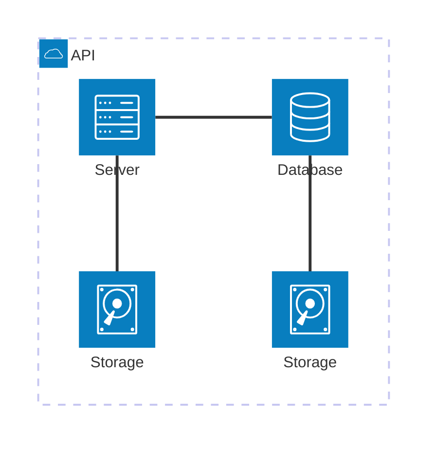

Webservices are often separated into two parts:
- The _client_ side which runs on your PC in a browser
- The _server_ side which does not run on you PC

The _client_ side displays content.
It uses [html](https://en.wikipedia.org/wiki/HTML) for the layout, [css](https://en.wikipedia.org/wiki/CSS) for styling and [javascript](https://en.wikipedia.org/wiki/JavaScript) for interactivity.

To fetch content, the _client_ often needs to interact with the _server_.

This is often done through an [API](https://en.wikipedia.org/wiki/API).

